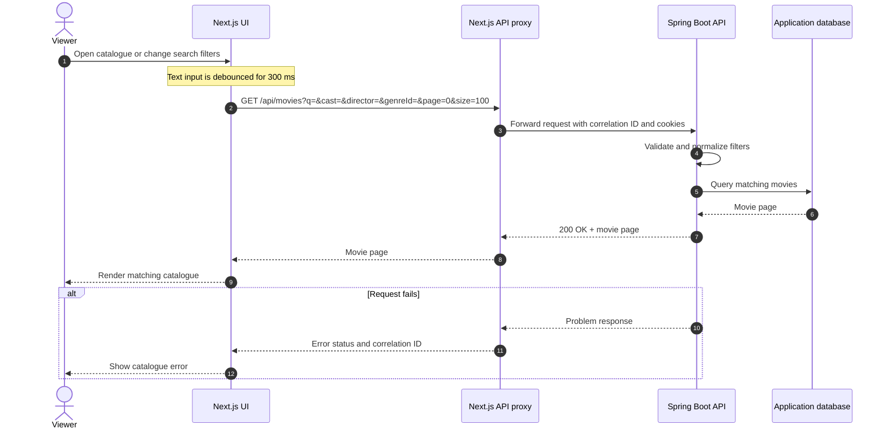

# Browse and search the catalogue

```mermaid
sequenceDiagram
    autonumber
    actor Viewer
    participant UI as Next.js UI
    participant Proxy as Next.js API proxy
    participant API as Spring Boot API
    participant DB as Application database

    Viewer->>UI: Open catalogue or change search filters
    Note over UI: Text input is debounced for 300 ms
    UI->>Proxy: GET /api/movies?q=&cast=&director=&genreId=&page=0&size=100
    Proxy->>API: Forward request with correlation ID and cookies
    API->>API: Validate and normalize filters
    API->>DB: Query matching movies
    DB-->>API: Movie page
    API-->>Proxy: 200 OK + movie page
    Proxy-->>UI: Movie page
    UI-->>Viewer: Render matching catalogue

    alt Request fails
        API-->>Proxy: Problem response
        Proxy-->>UI: Error status and correlation ID
        UI-->>Viewer: Show catalogue error
    end
```

