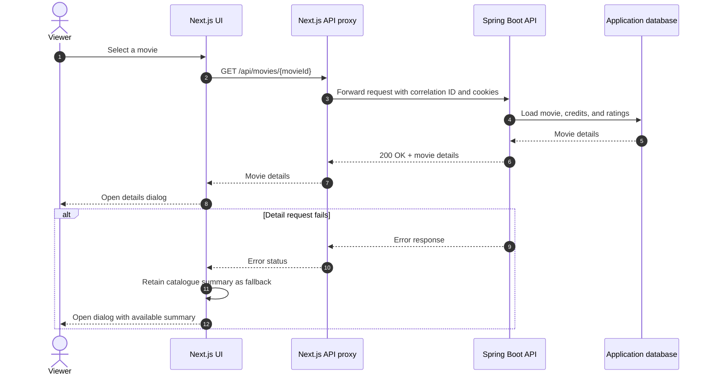

# View movie details

```mermaid
sequenceDiagram
    autonumber
    actor Viewer
    participant UI as Next.js UI
    participant Proxy as Next.js API proxy
    participant API as Spring Boot API
    participant DB as Application database

    Viewer->>UI: Select a movie
    UI->>Proxy: GET /api/movies/{movieId}
    Proxy->>API: Forward request with correlation ID and cookies
    API->>DB: Load movie, credits, and ratings
    DB-->>API: Movie details
    API-->>Proxy: 200 OK + movie details
    Proxy-->>UI: Movie details
    UI-->>Viewer: Open details dialog

    alt Detail request fails
        API-->>Proxy: Error response
        Proxy-->>UI: Error status
        UI->>UI: Retain catalogue summary as fallback
        UI-->>Viewer: Open dialog with available summary
    end
```

