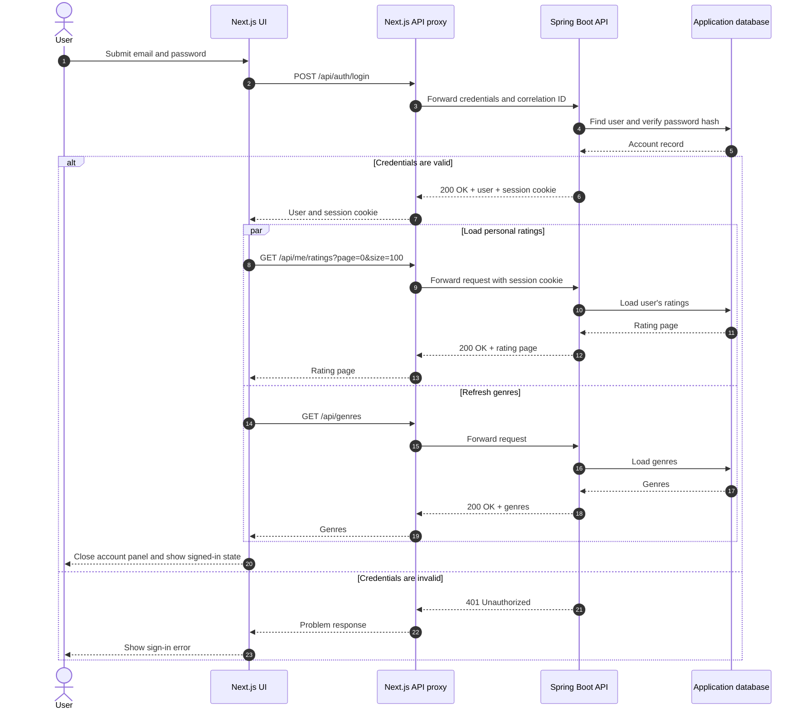

# Sign in

```mermaid
sequenceDiagram
    autonumber
    actor User
    participant UI as Next.js UI
    participant Proxy as Next.js API proxy
    participant API as Spring Boot API
    participant DB as Application database

    User->>UI: Submit email and password
    UI->>Proxy: POST /api/auth/login
    Proxy->>API: Forward credentials and correlation ID
    API->>DB: Find user and verify password hash
    DB-->>API: Account record

    alt Credentials are valid
        API-->>Proxy: 200 OK + user + session cookie
        Proxy-->>UI: User and session cookie
        par Load personal ratings
            UI->>Proxy: GET /api/me/ratings?page=0&size=100
            Proxy->>API: Forward request with session cookie
            API->>DB: Load user's ratings
            DB-->>API: Rating page
            API-->>Proxy: 200 OK + rating page
            Proxy-->>UI: Rating page
        and Refresh genres
            UI->>Proxy: GET /api/genres
            Proxy->>API: Forward request
            API->>DB: Load genres
            DB-->>API: Genres
            API-->>Proxy: 200 OK + genres
            Proxy-->>UI: Genres
        end
        UI-->>User: Close account panel and show signed-in state
    else Credentials are invalid
        API-->>Proxy: 401 Unauthorized
        Proxy-->>UI: Problem response
        UI-->>User: Show sign-in error
    end
```

