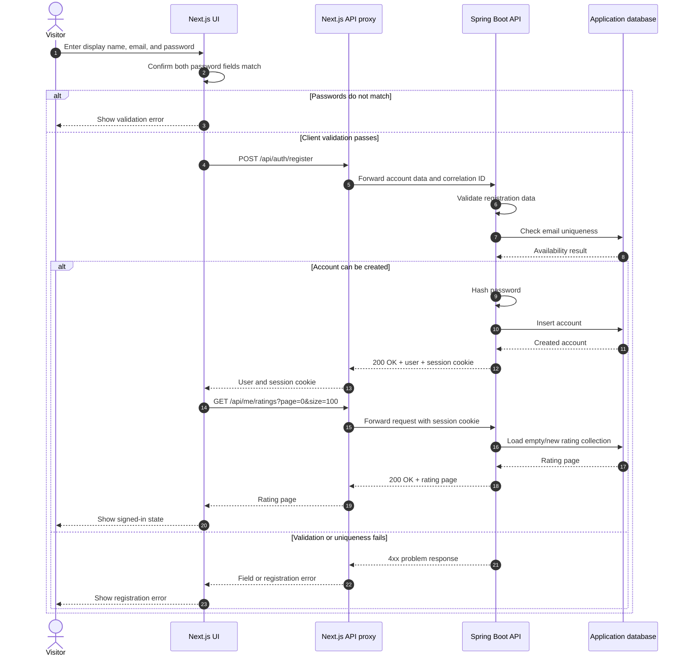

# Register an account

```mermaid
sequenceDiagram
    autonumber
    actor Visitor
    participant UI as Next.js UI
    participant Proxy as Next.js API proxy
    participant API as Spring Boot API
    participant DB as Application database

    Visitor->>UI: Enter display name, email, and password
    UI->>UI: Confirm both password fields match

    alt Passwords do not match
        UI-->>Visitor: Show validation error
    else Client validation passes
        UI->>Proxy: POST /api/auth/register
        Proxy->>API: Forward account data and correlation ID
        API->>API: Validate registration data
        API->>DB: Check email uniqueness
        DB-->>API: Availability result

        alt Account can be created
            API->>API: Hash password
            API->>DB: Insert account
            DB-->>API: Created account
            API-->>Proxy: 200 OK + user + session cookie
            Proxy-->>UI: User and session cookie
            UI->>Proxy: GET /api/me/ratings?page=0&size=100
            Proxy->>API: Forward request with session cookie
            API->>DB: Load empty/new rating collection
            DB-->>API: Rating page
            API-->>Proxy: 200 OK + rating page
            Proxy-->>UI: Rating page
            UI-->>Visitor: Show signed-in state
        else Validation or uniqueness fails
            API-->>Proxy: 4xx problem response
            Proxy-->>UI: Field or registration error
            UI-->>Visitor: Show registration error
        end
    end
```

