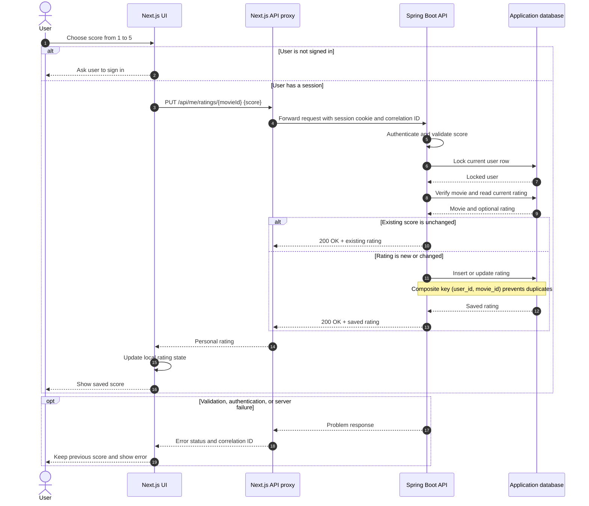

# Save or update a personal rating

```mermaid
sequenceDiagram
    autonumber
    actor User
    participant UI as Next.js UI
    participant Proxy as Next.js API proxy
    participant API as Spring Boot API
    participant DB as Application database

    User->>UI: Choose score from 1 to 5

    alt User is not signed in
        UI-->>User: Ask user to sign in
    else User has a session
        UI->>Proxy: PUT /api/me/ratings/{movieId} {score}
        Proxy->>API: Forward request with session cookie and correlation ID
        API->>API: Authenticate and validate score
        API->>DB: Lock current user row
        DB-->>API: Locked user
        API->>DB: Verify movie and read current rating
        DB-->>API: Movie and optional rating

        alt Existing score is unchanged
            API-->>Proxy: 200 OK + existing rating
        else Rating is new or changed
            API->>DB: Insert or update rating
            Note over API,DB: Composite key (user_id, movie_id) prevents duplicates
            DB-->>API: Saved rating
            API-->>Proxy: 200 OK + saved rating
        end

        Proxy-->>UI: Personal rating
        UI->>UI: Update local rating state
        UI-->>User: Show saved score
    end

    opt Validation, authentication, or server failure
        API-->>Proxy: Problem response
        Proxy-->>UI: Error status and correlation ID
        UI-->>User: Keep previous score and show error
    end
```

