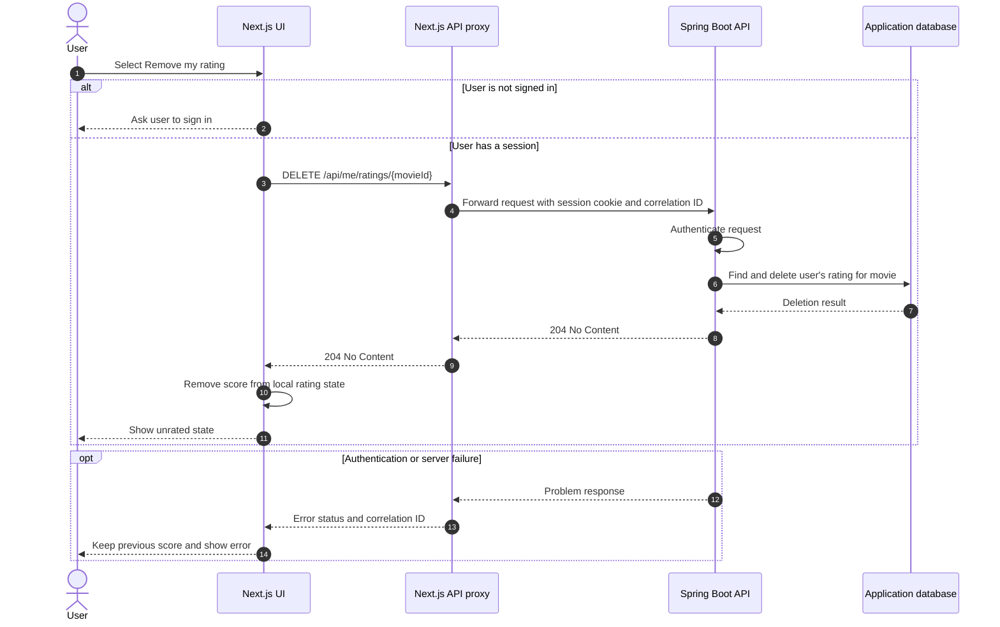

# Remove a personal rating

```mermaid
sequenceDiagram
    autonumber
    actor User
    participant UI as Next.js UI
    participant Proxy as Next.js API proxy
    participant API as Spring Boot API
    participant DB as Application database

    User->>UI: Select Remove my rating

    alt User is not signed in
        UI-->>User: Ask user to sign in
    else User has a session
        UI->>Proxy: DELETE /api/me/ratings/{movieId}
        Proxy->>API: Forward request with session cookie and correlation ID
        API->>API: Authenticate request
        API->>DB: Find and delete user's rating for movie
        DB-->>API: Deletion result
        API-->>Proxy: 204 No Content
        Proxy-->>UI: 204 No Content
        UI->>UI: Remove score from local rating state
        UI-->>User: Show unrated state
    end

    opt Authentication or server failure
        API-->>Proxy: Problem response
        Proxy-->>UI: Error status and correlation ID
        UI-->>User: Keep previous score and show error
    end
```

