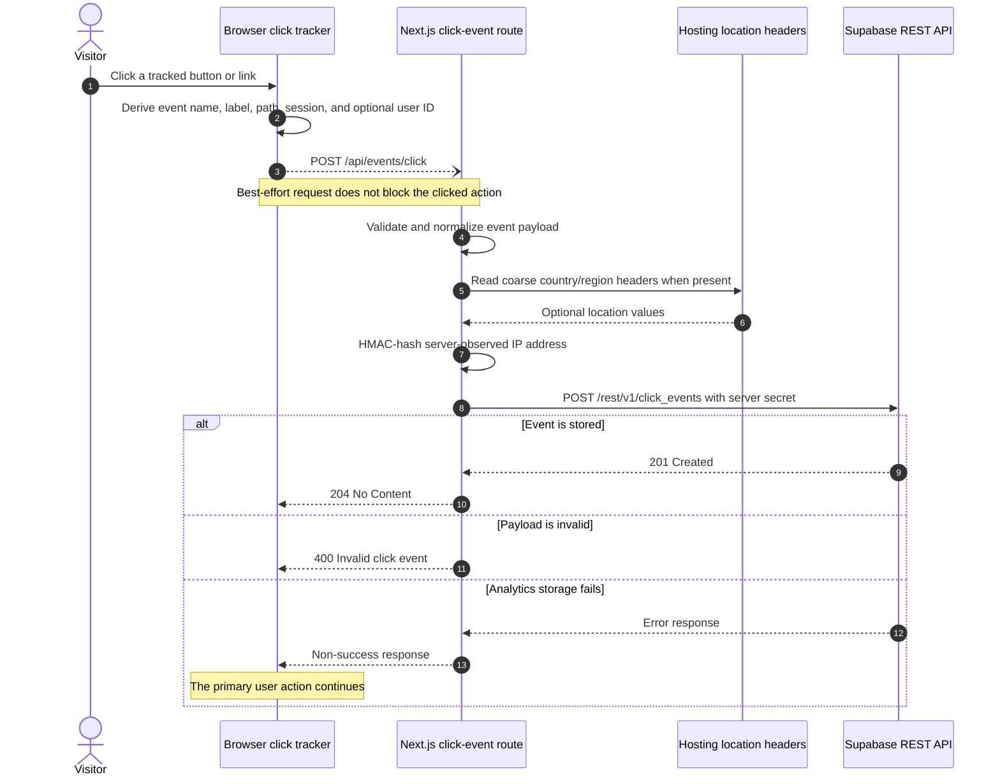

# Track a click event

```mermaid
sequenceDiagram
    autonumber
    actor Visitor
    participant UI as Browser click tracker
    participant Route as Next.js click-event route
    participant Geo as Hosting location headers
    participant DB as Supabase REST API

    Visitor->>UI: Click a tracked button or link
    UI->>UI: Derive event name, label, path, session, and optional user ID
    UI--)Route: POST /api/events/click
    Note over UI,Route: Best-effort request does not block the clicked action
    Route->>Route: Validate and normalize event payload
    Route->>Geo: Read coarse country/region headers when present
    Geo-->>Route: Optional location values
    Route->>Route: HMAC-hash server-observed IP address
    Route->>DB: POST /rest/v1/click_events with server secret

    alt Event is stored
        DB-->>Route: 201 Created
        Route-->>UI: 204 No Content
    else Payload is invalid
        Route-->>UI: 400 Invalid click event
    else Analytics storage fails
        DB-->>Route: Error response
        Route-->>UI: Non-success response
        Note over UI: The primary user action continues
    end
```
